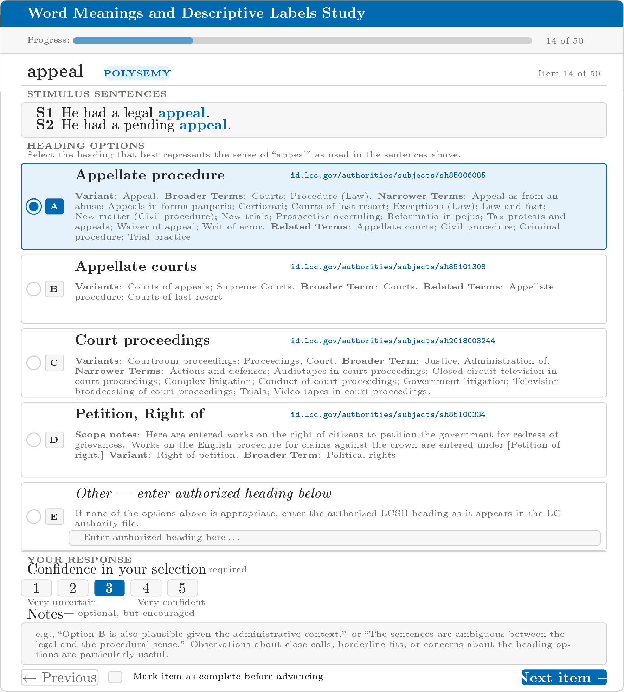
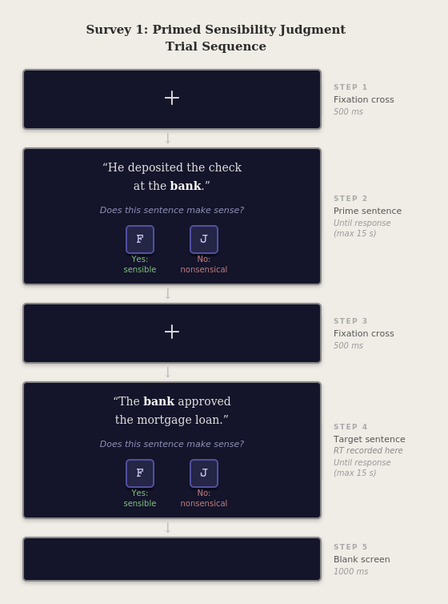
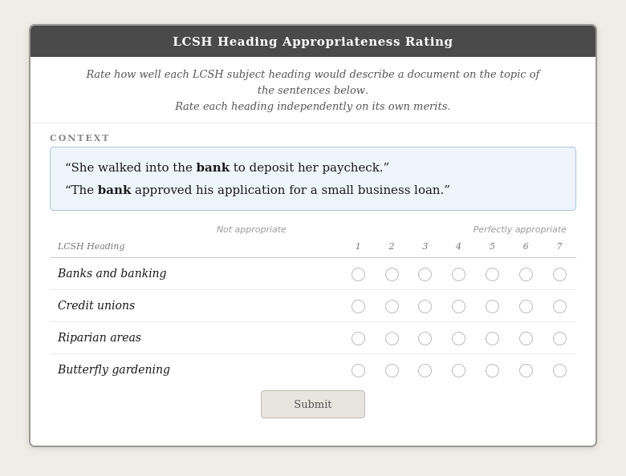

## Overview

This page collects all materials submitted with IRB Protocol 2446127,
resubmitted as an **exempt certification** under 45 CFR 46.104(d)(2), (d)(3),
and (d)(4) for pilot testing only.

## Documents

::: {.file-card}
[📄 Letter to Reviewer](../assets/pdf/irb_letter_to_reviewer.pdf)
:::

::: {.file-card}
[📄 Application Form — Protocol 2446127](../assets/pdf/irb_application_form.pdf)
:::

::: {.file-card}
[📄 Appendix O — Secondary Data Use](../assets/pdf/irb_appendix_o.pdf)
:::

::: {.file-card}
[📄 Online Survey Consent Form](../assets/pdf/irb_consent_form.pdf)
:::

::: {.file-card}
[📄 Supplemental Procedures Document](../assets/pdf/irb_supplemental_document.pdf)

*Includes Part A (librarian consultation), Part B (pilot testing),
Part C (exempt certification justification).*
:::

::: {.file-card}
[📄 Complete Stimulus Set](../assets/pdf/irb_stimulus_set.pdf)
:::

## Survey Mockups

